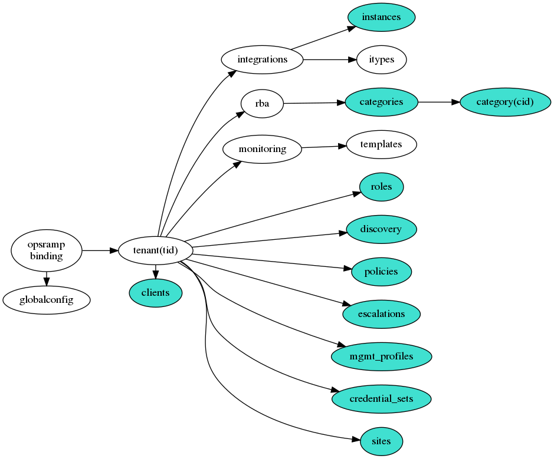

<!---
(c) Copyright 2019-2020 Hewlett Packard Enterprise Development LP

Licensed under the Apache License, Version 2.0 (the "License");
you may not use this file except in compliance with the License.
You may obtain a copy of the License at

    http://www.apache.org/licenses/LICENSE-2.0

Unless required by applicable law or agreed to in writing, software
distributed under the License is distributed on an "AS IS" BASIS,
WITHOUT WARRANTIES OR CONDITIONS OF ANY KIND, either express or implied.
See the License for the specific language governing permissions and
limitations under the License.
-->
# python-opsramp
A Python language binding for the OpsRamp API

TravisCI [](https://travis-ci.org/HewlettPackard/python-opsramp)
CircleCI [](https://circleci.com/gh/HewlettPackard/python-opsramp)

## About
This directory tree contains a Python module that provides a convenient way to
access the OpsRamp REST API programmatically. The OpsRamp API documentation is
somewhat opaque and this binding hides some of the details for exactly that reason.
I have also added "assert" statements in various places to guard against pitfalls
that I ran into that are not obvious from the API docs.

### Scope
The basic framework of this library is in place and the
scope will increase incrementally over time. The supplied samples
exercise most of the main API sections and are described
later in this document.

Note however that all of our wrapper objects also provide an `api` property that
can be used to access REST URLs further down the API tree
where we have not written a specific wrapper class yet.

While you can use these api objects to work directly with OpsRamp at a REST level,
please consider taking the small amount of time needed to add a proper wrapper class
here instead, for your own benefit and that of future users.

### Return values
All functions in this binding return regular Python objects (not JSON strings).
In general you will need to look at the OpsRamp API docs to see exactly what
sort of object and/fields the response will contain; typically we return exactly
what the API gave us, or an equivalent Python object if it returned JSON.

### Runtime Environment
This module is primarily designed for use on Python 3.

We also run the unit tests against Python 2.7 and it *should* work correctly there
too. Note however that Python 2 is going end-of-life in late 2019 and we reserve
the right to drop support for it in a future version of this module.

## Public Object Tree
Following is a summary of the object tree currently available in this OpsRamp language binding. See
the "Samples" section later in this document for an illustration of how to use them.

You start by calling `opsramp.binding.connect()`
which returns a single "OpsRamp" object to represent the entire REST API instance
that you want to access, and make a series of calls that return progressively lower level objects to access
lower level information from OpsRamp. For clarity in these end-user instructions I have omitted several Python
classes that are internal implementation detail in the module and not intended for direct use by external callers.

Here's an illustration of a simple use of the binding. See the Samples section for more detailed ones.
```
import opsramp.binding

ormp = opsramp.binding.connect(OPSRAMP_URL, KEY, SECRET)
cfg = ormp.config()
print('alert types', cfg.get_alert_types())
print('timezones', cfg.get_timezones())
```

### Class diagram
This diagram is an overview of the public classes and their relationship to each other.
The individual classes are described in detail in the following section. This diagram
was produced using [Graphviz](https://www.graphviz.org/) `apt-get install graphviz`
and to edit it you need to modify the
source file classes.dot and regenerate the PNG from that.

`dot -Tpng < classes.dot > classes.png`



I have used color to highlight the subset of classes that implement a "create" method.

### Class definitions

import opsramp.binding

- def connect(url, key, secret) _returns an instance of the class Opsramp that is connected to the specified API endpoint_
  This function posts a login request to the specified endpoint URL using the key and secret given. This post
  returns an access token, which the function uses to construct an Opsramp object and returns that.
- class Opsramp(url, token) _an object representing the complete API tree of one OpsRamp instance_
  - config() -> returns a GlobalConfig object that can be used to access global settings for this OpsRamp instance.
  - tenant(uuid) -> returns a Tenant object representing the API subtree for one specific tenant.

import opsramp.globalconfig

- class GlobalConfig() _read-only access to global settings on this OpsRamp instance_
  - get\_alert\_types() -> returns a list of the global alert types that are defined on this OpsRamp instance.
  - get\_channels() -> returns a list of the "channels" that are defined on this OpsRamp instance. See the OpsRamp docs for details.
  - get\_countries() -> a list of dicts each describing one country known to this OpsRamp instance.
  - get\_timezones() -> a list of dicts each describing one timezone known to this OpsRamp instance.
  - get\_alert\_technologies() -> a list of dicts each describing one alert technology known to this OpsRamp instance.
  - get\_nocs() -> a list of dicts each describing one NOC known to this OpsRamp instance.
  - get\_device\_types() -> a list of dicts each describing device type known to this OpsRamp instance.

import opsramp.tenant

- class Tenant(uuid) _the API subtree for one specific tenant_
  - get\_alert\_script() -> Returns a string containing the appropriate Python script to run on a Linux node
  to install the OpsRamp agent there and connect it to this Tenant. This text contains the tenant's access keys
  so think twice before printing it to the screen or logs.
  - integrations() -> returns an Integrations object representing all integrations on this Tenant.
  - rba() -> returns an Rba object representing all runbook automation information for this Tenant.
  - monitoring() -> returns a Monitoring object representing all monitoring information for this Tenant.
  - policies() -> returns a Policies object representing the device management policies on this Tenant.
  - clients() ->  returns a Clients object representing all OpsRamp clients on this Tenant. _Note that
  this is only valid for MSP-level tenants because an OpsRamp client cannot contain other clients._
  - discovery() -> returns a Discovery object representing all OpsRamp Discovery profiles for this Tenant.
  - credential\_sets() -> returns a Credential set object representing all OpsRamp Discovery profiles for this Tenant.
  - permission\_sets() -> returns a PermissionSets object representing all OpsRamp RBAC permission sets for this Tenant.
  - roles() -> returns a Roles object representing all OpsRamp RBAC roles for this Tenant.
  - escalations() -> returns an Escalations object representing the Alert Escalation Policies of this Tenant.
  - mgmt\_profiles() -> returns a Profiles object representing the Management Profiles of this Tenant. These are used
  to connect OpsRamp gateway node to the SaaS.
  - sites() -> returns a Sites object. Sites are used to organize devices based on location.
  - service\_maps() -> returns a ServiceMaps object. Service maps are used to create directed graphs of dependencies
  that are used in the OpsRamp UI to present human-readable graphs of the impact of service failures on each other.
  - kb() -> returns a KnowledgeBase object. These are used to organize
  knowledge base articles and categories related to this tenant.
  - resources() -> returns a Resources object representing all OpsRamp resources on this Tenant
  - first_response() -> returns an First_Response object representing the Alert First Response Policies of this Tenant

import opsramp.service\_maps

- class ServiceMaps() _the ServiceMaps that are defined for this specific Tenant_
  - create(definition) -> Creates a new service map in this Tenant. "definition" is a Python dict.
  - update(uuid, definition) -> Updates an existing service map
  - delete(uuid) -> Deletes an existing service map
  - get(uuid=None, minimal=False) -> returns a list of dicts, each one containing details for one service map.

import opsramp.roles

- class PermissionSets() _the RBAC permission sets that are defined for this specific Tenant_
  - search(pattern) -> returns a list of dicts, each containing a single description.

- class Roles() _the subtree of RBAC roles that are defined for this specific Tenant_
  - create(definition) -> Creates a new RBAC role in this Tenant. "definition" is a Python dict.
  - update(uuid, definition) -> Updates an existing role.
  - delete(uuid) -> Deletes an existing role.
  - search(pattern) -> returns a list of dicts, each containing a single role description.

import opsramp.sites

- class Sites() _the subtree of Sites that are defined for this specific Tenant_
  - create(definition) -> Creates a new site in this Tenant. "definition" is a Python dict.
  - update(uuid, definition) -> Updates an existing site
  - delete(uuid) -> Deletes an existing site
  - search(pattern) -> returns a list of dicts, each containing a single site.
  - get() -> returns a list of dicts, each one containing minimal details for one site.

import opsramp.monitoring

- class Monitoring() _the monitoring information subtree for one specific Tenant_
  - templates() -> returns a Templates object representing the set of monitoring templates on this Tenant.

- class Templates() _the set of monitoring templates for one Tenant_
  - search(pattern) -> returns a list of templates that match the pattern. See the OpsRamp API docs for details
  on the format of the pattern string.

import opsramp.rba

- class Rba() _the runbook automation subtree of one specific Tenant_
  - categories() -> the subtree containing the RBA categories of this Tenant

- class Categories() _the subtree for the RBA categories of one specific Tenant_
  - get() -> Return a list of all the script categories in this Tenant RBA subtree.
  - get(uuid) -> returns the definition of one specific category as a Python dict.
  See the OpsRamp API docs for detailed contents of these dicts.
  - create(name, optional parent\_uuid) -> creates a new *category* on this Tenant and
  returns its uuid. Optionally takes the uuid of a pre-existing category under which to nest the new one.
  - category(uuid) -> returns a Category object representing the API subtree for one specific category.
  - update(uuid, definition) -> Updates an existing category
  - delete(uuid) -> Deletes an existing category

- class Category() _the subtree for one RBA category_
  - get() -> returns a list of the scripts in this category.
  - get(uuid) -> returns the definition of one specific script as a Python dict.
  See the OpsRamp API docs for detailed contents of these dicts.
  - create(definition) -> creates a new *script* in this category. "definition" is a Python dict
  specifying details of the script to be created. The content of these structs is complex so helper
  functions for creating them are provided below.
  - @staticmethod mkParameter(name, description, datatype, optional=False, default=None) -> helper function that returns a
  Python dict describing one parameter of a proposed new script.
  - @staticmethod mkScript(name, description, platforms, execution\_type, payload=None, payload\_file=None, parameters=[], script\_name=None, install\_timeout=0, registry\_path=None, registry\_value=None, process\_name=None, service\_name=None, output\_directory=None, output\_file=None) -> helper function that returns
  a Python dict describing a proposed new script. There are lots of optional arguments because these structs
  have variable content depending on the type of script and also some are only applicable on Linux, some only on Windows.
  The function contains `assert` statements to flag violations of (some of) those rules.
  I may add another layer of helpers later that are more specificially targetted (like "mkPythonLinuxScript" for example)
  and implement those by calling mkScript() internally with appropriate arguments.
  - update(uuid, definition) -> Updates an existing *script* in this category given the uuid of the script.The Python dict, "definition" is similar to the one used for create call and the helper functions used for create can be used for update too.

import opsramp.msp

- class Clients() _the subtree containing all clients of this MSP-level tenant_
  An OpsRamp client cannot contain other clients so this is class is only useful with MSP-level tenants.
  - get() -> returns a list of dicts, each one containing minimal details for one client. It's worth
  noting that the main ID field in the objects that get returned is called *uniqueId* and this is the
  value you need to use everywhere in this binding that a client ID is required.
  - get(uuid) -> returns the definition of one specific client as a Python dict.
  See the OpsRamp API docs for detailed contents of these dicts.
  - search(self, pattern='') -> returns a list of client ids matching the specified search pattern, the format of
  which is described in the OpsRamp documentation.
  - create(definition) -> creates a new Client in this Tenant. "definition" is a Python dict
  specifying details of the client to be created.
  The content of these structs is complex so helper functions for creating them are provided below.
  - update(uuid, definition) -> "definition" is a Python dict specifying the changes to be made to this client.
  The contents are described in the OpsRamp docs and helper functions for creating these dicts are provided here.
  - activate(uuid) -> marks the client as "active" in OpsRamp.
  - suspend(uuid) -> marks the client as "suspended" in OpsRamp. _This takes 10+ seconds to run._
  - terminate(uuid) -> terminates the client in OpsRamp. _The API docs say that this call deletes the client but in
  reality it just goes onto an "inactive" list that is retrievable through the API and visible in the UI. OpsRamp
  say that clients on the inactive list will get garbage collected eventually, but I couldn't get clarity on
  how long "eventually" is._
  - @staticmethod mkHours(day\_start=datetime.time(9, 0),
                day\_end=datetime.time(17, 0),
                week\_start=2, week\_end=6,
                sms\_voice\_notification=False) -> returns a dict that can be used to define
  customer working and opening hours in OpsRamp.
  - @staticmethod mkClient(name, address, time\_zone, country, hours=None) -> returns a dict that can be
  used to create a new client.

import opsramp.devmgmt

- class Policies() _the policies subtree of one specific Tenant_
  - get() -> returns a list of dicts, each containing a single policy definition.
  - get(uuid) -> returns the definition of one specific policy as a Python dict.
  See the OpsRamp API docs for detailed contents of these dicts.
  - search(pattern) -> Search for a policy with a specific name. The syntax is defined in the OpsRamp docs.
  - create(definition) -> creates a new policy in this Tenant. "definition" is a Python dict
  specifying details of the policy to be created.
  The contents are described in the OpsRamp docs and helper functions for creating these dicts are provided here.
  - update(uuid, definition) -> Updates an existing policy.
  "definition" is a Python dict specifying the changes to be made.
  The contents are described in the OpsRamp docs and helper functions for creating these dicts are provided here.
  - run(uuid) -> sends a request to the OpsRamp server to run this policy now. _The actual run is asynchronous._
  - delete(uuid) -> deletes this policy from the OpsRamp server.

- class Discovery() _the discovery profile subtree of one specific Tenant_
  - search(pattern) -> returns a list of dicts, each containing a single discovery profile.
  - create(definition) -> Creates a new discovery profile in this Tenant. "definition" is a Python dict.
  - update(definition) -> Updates an existing discovery profile.
  - rescan(discoveryProfileId) -> Causes a discovery profile to run.
  - delete(discoveryProfileId) -> Deletes this discovery profile.

- class CredentialSets() _the Credential set subtree of one specific Tenant_
  - get(credentialSetId, minimal) -> Returns a Credential set definition.
  - create(definition) -> Creates a new Credential set in this Tenant.
  - update(credentialSetId, definition) -> Update an existing Credential set.
  - delete(credentialSetId) -> Delete a Credential set.

import opsramp.integrations

- class Integrations() _the integrations subtree of one specific Tenant_
  - itypes() -> Returns a Types object describing all the *types*
  of integrations that are available to be installed on this Tenant. Each
  represents a *category* like CUSTOM, AZURE, rather than specific instances
  of those.
  - instances() -> Returns an Instances object representing all the actual
  instances of integrations that are installed on this Tenant.
  - _available() -> A synonym for "types()" that I included because that's
  the name of the API endpoint in OpsRamp that returns this set of data.
  It took a while to figure out what the returned data means though,
  so we went with the more obvious name "types" here instead._
  - _installed() -> A synonym for "instances()" that I included because that's
  the name of the API endpoint in OpsRamp that returns this set of data.
  It took a while to figure out what the returned data means though,
  so we went with the more obvious name "instances" here instead._

- class Types() _a set of integration types_
  - get() -> returns a list of dicts, each containing a single integration type.
  - get(uuid) -> returns the definition of one specific type as a Python dict.
  - search(pattern) -> Search for an integration type with a specific name or
  other attributes. The syntax of the pattern is defined in the OpsRamp docs.
  Returns a list of type definition dicts.

- class Instances() _the actual integration instances on one specific Tenant_
  - get() -> returns a list of dicts, each containing a single integration instance.
  - get(uuid) -> returns the definition of one specific integration instance as a Python dict.
  - search(pattern) -> Search for existing integration instances with specific name or
  other attributes. The syntax of the pattern is defined in the OpsRamp docs.
  Returns a list of instance definition dicts.
  - create(type\_name, definition) -> creates a new instance of a specific
  integration type on this Tenant. "definition" is a Python dict specifying
  details of the integration instance that is to be created.
  The contents are described in the OpsRamp docs and helper functions for creating these dicts are provided here.
  - update(definition) -> "definition" is a Python dict specifying the changes
  to be made to this instance. The contents are described in the OpsRamp docs
  and helper functions to construct them exist in the Integrations class.
  - get\_kubernetes\_configuration(uuid) -> Returns the content of the Kubernetes
  configuation file for a given integration as a string. Raises an exception if
  that concept has no meaning for the type of integration specified.
  - set\_auth\_type(self, auth\_type) -> sets the authentication type for this
  integration to one of "OAUTH2", "WEBHOOK", "BASIC" and returns a dict that
  contains the keys etc that are needed to connect to this integration using
  that auth method. Note that OAUTH2 secret values are redacted by default in
  the API response.
  - enable(uuid) -> marks a specific instance as "enabled" in OpsRamp.
  - disable(uuid) -> marks a specific instance as "disabled" in OpsRamp.
  - notifier(uuid, definition) -> configures a notifier on one specific instance.
  "definition" is a Python dict specifying details of the new configuration.
  The syntax is defined in the OpsRamp docs. Helper functions for creating
  these dicts will be added later.
  - @staticmethod mkEmailAlert(display\_name, logo\_fname=None) ->
  helper function that returns a Python dict suitable for creating or updating
  an integration instance of type EMAILALERT.
  - @staticmethod mkCustom(display\_name, logo\_fname=None, parent\_uuid=None, inbound\_auth\_type=None) ->
  helper function that returns a Python dict suitable for creating or updating
  an integration instance of type CUSTOM.
  - @staticmethod mkAzureARM(display\_name, arm\_subscription\_id,
  arm\_tenant\_id, arm\_client\_id, arm\_secret\_key) ->
  helper function that returns a Python dict suitable for creating or updating
  an integration instance of type AZUREARM. Note that ARM and ASM integrations
  are different and each has its own helper function.
  - @staticmethod mkAzureASM(display\_name, arm\_subscription\_id,
  arm\_mgmt\_cert, arm\_keystore\_pass) ->
  helper function that returns a Python dict suitable for creating or updating
  an integration instance of type AZUREASM. Note that ARM and ASM integrations
  are different and each has its own helper function.

- class Escalations() _the subtree of Alert Escalation Policies that are defined for this specific Tenant_
  - create(definition) -> Creates a new escalation policy in this Tenant. "definition" is a Python dict.
  - update(uuid, definition) -> Updates an existing escalation policy.
  - delete(uuid) -> Deletes an existing escalation policy.
  - search(pattern) -> returns a list of dicts, each containing a single policy.
  - enable(uuid) -> marks a specific instance as "enabled" in OpsRamp.
  - disable(uuid) -> marks a specific instance as "disabled" in OpsRamp.
  
- class Profiles() _the subtree of Management Profiles that are defined for this specific Tenant_
  - create(definition) -> Creates a new mgmt profile in this Tenant. "definition" is a Python dict.
  - update(uuid, definition) -> Updates an existing mgmt profile.
  - delete(uuid) -> Deletes an existing mgmt profile.
  - search(pattern) -> returns a list of dicts, each containing a single profile.
  - attach(uuid) -> This is used to attach OpsRamp Gateway and returns an activation token.
  - detach(uuid) -> Detach the existing gateway and invalidate its activation token.
  - reconnect(uuid) -> Error recovery should happen automatically but this can be called
  to "do it now". _It's unclear at this time in what circumstances this would be used._

- class KnowledgeBase() _the subtree of knowledge base that is defined for this specific Tenant_
  - categories() -> Returns a KBcategories object representing the knowledge base
  categories for this tenant.
  - articles() -> Returns a KBarticles object representing the knowledge base
  articles for this tenant.
  - templates() -> Returns a KBtemplates object representing the knowledge base
  templates for this tenant.

- class First_Response() _the subtree of Alert First Response Policies that are defined for this specific Tenant_
  - create(definition) -> Creates a new first response policy in this Tenant. "definition" is a Python dict.
  - policy_detail(uuid) -> returns the detaail for a specific first response policy
  - update(uuid, definition) -> Updates an existing first response policy.
  - delete(uuid) -> Deletes an existing first response policy.
  - search(pattern) -> returns a list of dicts, each containing in a client.
  - enable(uuid) -> marks a specific instance as "enabled" in OpsRamp.
  - disable(uuid) -> marks a specific instance as "disabled" in OpsRamp. 

- class KBcategories() _the subtree of knowledge base categories for this specific Tenant_
  - create(definition) -> creates a KB category.
  - update(uuid, definition) -> updates an existing KB category.
  - delete(uuid) -> deletes an existing KB category.
  - search(pattern) -> searches for categories matching a pattern.
  - children(uuid) -> returns a list of the child categories of uuid.
  - restore(uuid) -> undeletes category uuid (if it has not been
  garbage collected yet).

- class KBarticles() _the subtree of knowledge base articles for this specific Tenant_
  - create(definition) -> creates a KB article.
  - update(uuid, definition) -> updates an existing KB article.
  - delete(uuid) -> deletes an existing KB article.
  - search(pattern) -> searches for articles matching a pattern.
  - share(uuid) -> marks article uuid as "shared" _I don't know what that means_
  - comments(uuid) -> returns a list of the comments on article uuid.

- class KBtemplates() _the subtree of knowledge base templates for this specific Tenant_
  - create(definition) -> creates a KB template.
  - update(uuid, definition) -> updates an existing KB template.
  - delete(uuid) -> deletes an existing KB template.
  - search(pattern) -> searches for templates matching a pattern.

import opsramp.resources

- class Resources() _the subtree of Resources that are defined for this specific Tenant_
  - create(definition) -> Creates a new resource in this Tenant. "definition" is a Python dict.
  - update(uuid, definition) -> updates an existing resource.
  - delete(uuid) -> deletes an existing resource.
  - search(pattern) -> searches for resources matching a pattern.
  - minimal(pattern) -> similar to search but returns minimal details about each resource to
  improve performance and reduce runtime. _This appears to work only on OpsRamp *clients.*_
  - applications(uuid) -> This endpoint is used to fetch list of applications running on a resource.
  - availability(uuid, start\_epoch, end\_epoch) -> fetch the availability details of a resource
  within a specific time frame. The times are Unix epoch timestamps.

## Samples and examples
The `samples` subdirectory contains a series of short Python scripts illustrating
the use of most of the major API sections that we cover. These are supposed to be
self-explanatory so I will not document them in detail here. If any of the samples
are not obvious then please submit a PR that adds comments to the appropriate
source file explaining how it works, as an aid to other users.

All of the samples expect to be run as modules, like this:
```
ls -l samples/*.py
python3 -m samples.timezone_list
python3 -m samples.integration_list
python3 -m samples.category_list
python3 -m samples.client_list
... etc ...
```

### OpsRamp credentials
Each of the samples depends on the existence of some environment variables to tell it which OpsRamp
endpoint to use and the relevant creds. You can see those at the top of timezones.py
for example, and you must set them appropriately in your environment before running it.
```
export OPSRAMP_URL='https://my-org.api.try.opsramp.com'
export OPSRAMP_TENANT_ID='client_1234'
export OPSRAMP_KEY='whatever'
export OPSRAMP_SECRET='whatever'
```
The tenant id, key and secret are obtained from an "integration" in the OpsRamp UI.
You need to go to "setup", "integrations" and look for (or create) a row containing
a custom integration that uses OAUTH2. It doesn't matter what it's called, you just
need its id and creds to call the REST API.

On the list of integrations, click on the integration name in the appropriate row
and a screen appears with the "Tenant Id", "Key" and "Secret" fields that you need.
The UI even gives sample curl commands at the bottom and you can cut the URL value
out of those if it's not obvious. It's just the bit as far as opsramp.com like the
example above.

It's not obvious, but the creds you're getting here are for *the entire Tenant*
(aka client) and will be the same for all integrations on that Tenant. Be careful
with them, don't put them in logs or post them online by accident.

If there isn't a suitable integration already (or you want your own) then create a new
one by selecting the "other" tab in the Available Integrations section at the bottom
of the page and then "custom". Give it a name and leave the image file field blank.
The name will appear in access logs but otherwise has no real meaning. Select OAUTH2
as the authentication type and hit Save. This will bring you to the screen with keys
and curl commands etc as described above.

### examples.py
The file `examples.py` collects together a series of examples and illustrates most of
the major areas of the API that we cover. It uses the same environment variables as
the samples to tell it which OpsRamp tenant to examine.

`python3 -m opsramp.examples`

### Simple CLI prototype
I wrote a simple Python program that uses this binding to perform some simple
read-only operations on OpsRamp. Uses the same environment variables as above.
```
$ python3 -m opsramp.cli tenant rba categories | jq -S .
[
  {
    "id": 346,
    "name": "Day to day actions"
  },
  {
    "id": 698,
    "name": "DR procedures"
  }
]
$ python3 -m opsramp.cli tenant monitoring templates
538 monitoring templates found
$ python3 -m opsramp.cli tenant agent script | wc -l
763
$
```

## The API objects and direct REST calls
If we don't have a class that exposes the piece of the API that you want to use, then you can use the `ApiObject` base
class to make REST calls to that part directly while still using the correct wrapper classes for everything else.

The general approach would be to navigate to the nearest object for which we do have a wrapper and use its `api` property
to get an instance of the `ApiObject` class that you can then use to make direct REST calls to the tree below that point.
This still has an advantage over raw curl or "requests" calls because the enclosing object class will have set up the
URLs and access tokens for you.

### API object example
```
monitoring_api = ormp.tenant('client_9234').monitoring().api
result = monitoring_api.get('/templates')
print(result)
```
This uses a REST get() to retrieve the list of templates directly from OpsRamp, by starting from the api object
of a Monitoring object. The Monitoring object will have already done all the work to set up the correct tenant,
credentials and other context for that call so it's still much easier than making httplib, requests or curl
calls yourself.

- ApiObject() _an object representing some subtree of a REST API_
  - get(suffix='', headers={}) -> performs a GET to the specified REST endpoint and returns the body of the
  server's reply. "headers" is an optional dict containing any additional HTTP headers that you want to send
  with the GET.
  - post(suffix='', headers={}, data=None, json=None) -> performs a POST to the specified REST endpoint and
  returns the body of the server's reply. "headers" is an optional dict containing any additional HTTP headers
  that you want to send, "data" is the text body, or "json" is a Python struct to be converted to a JSON
  string and sent as a body. _Specifying both "data" and "json" in the same call results in undefined behavior
  and should be avoided._
  - put(suffix='', headers={}, data=None, json=None) -> performs a PUT to the specified REST endpoint and
  returns the body of the server's reply. "headers" is an optional dict containing any additional HTTP headers
  that you want to send, "data" is the text body, or "json" is a Python struct to be converted to a JSON
  string and sent as a body. _Specifying both "data" and "json" in the same call results in undefined behavior
  and should be avoided._
  - delete(suffix='', headers={}) -> performs a DELETE to the specified REST endpoint and returns the body of
  the server's reply. "headers" is an optional dict containing any additional HTTP headers that you want to send.
  - patch(suffix='', headers={}, data=None, json=None) -> performs a PATCH to the specified REST endpoint and
  returns the body of the server's reply. "headers" is an optional dict containing any additional HTTP headers
  that you want to send, "data" is the text body, or "json" is a Python struct to be converted to a JSON
  string and sent as a body. _Specifying both "data" and "json" in the same call results in undefined behavior
  and should be avoided._
  - _we will add other http actions if/when a specific need for them arises_
